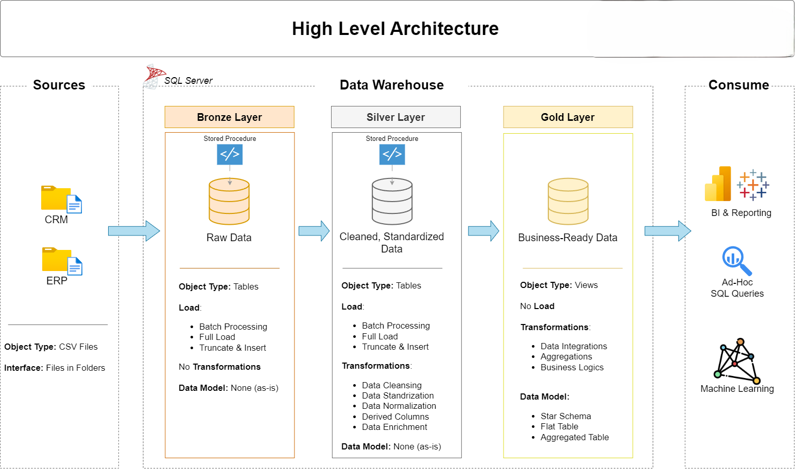
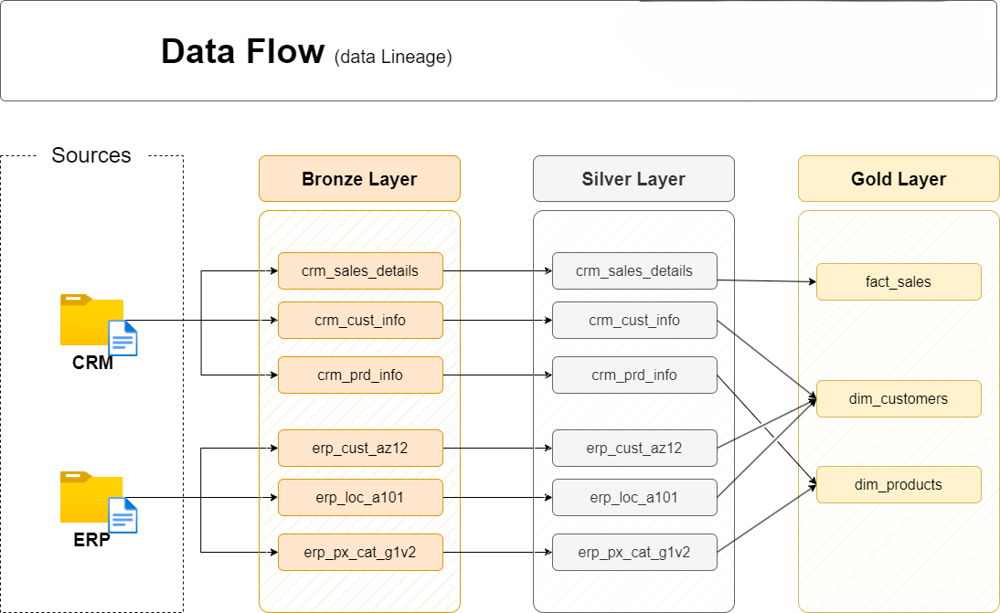
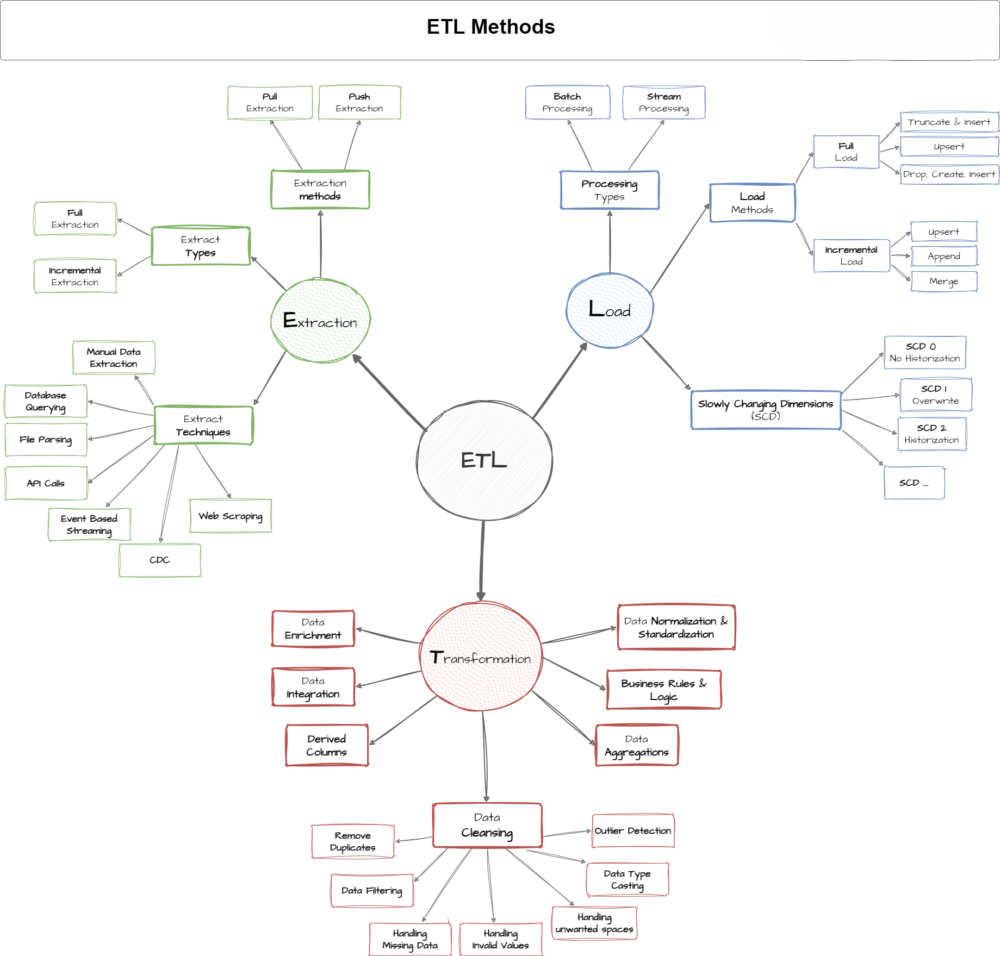
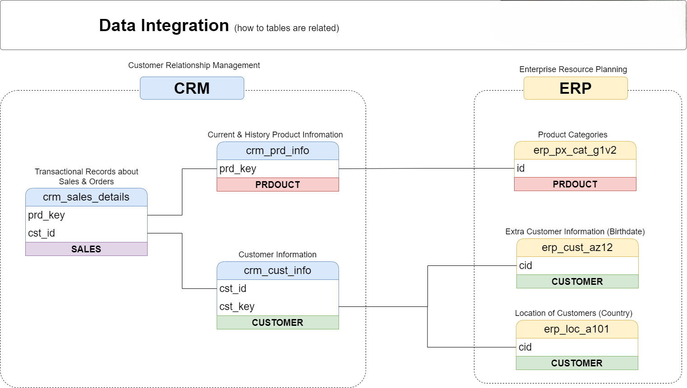
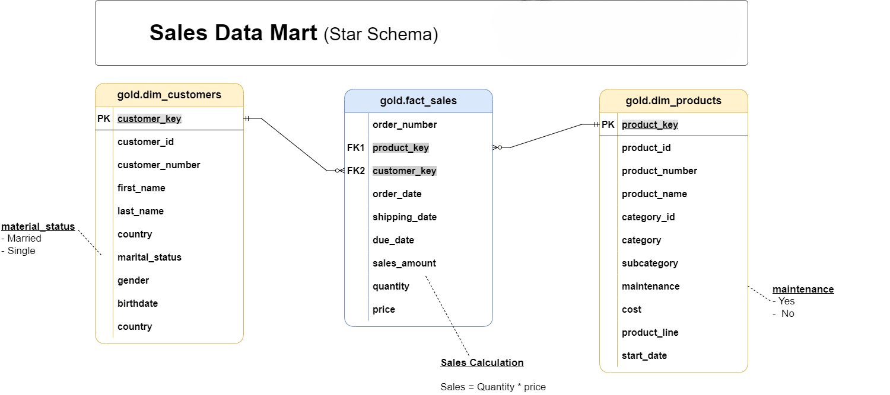

# Data Engineering Projects

This section showcases projects focused on designing reliable data systems, building transformation pipelines, and preparing structured datasets for analytical use cases.

The projects demonstrate practical experience with **SQL-based data warehousing, ETL development, data modelling, data quality validation, and analytics engineering principles.**

---

# SQL Data Warehouse & Analytics Engineering Project

[GitHub Repository](https://github.com/wahidupal/SQL_Data_Warehouse_Project)

## Project Overview

This project demonstrates the design and implementation of a complete SQL-based data warehouse solution using CRM and ERP source datasets.

The objective was to transform raw operational data into clean, reliable, and analysis-ready datasets through a structured ETL pipeline and dimensional modelling approach.

The warehouse follows a **Medallion Architecture** consisting of three layers:

- **Bronze Layer:** Raw data ingestion
- **Silver Layer:** Data cleaning, transformation, and validation
- **Gold Layer:** Business-ready analytical views following Star Schema principles

The final analytical model enables efficient querying and supports business reporting and analysis.

---

# Data Architecture

The project follows a layered data architecture where each stage has a dedicated responsibility:

### Bronze Layer: Raw Data Ingestion

The Bronze layer stores source data with minimal transformation.

Key responsibilities:

- Import CRM and ERP CSV files into SQL Server
- Preserve original source structure
- Provide the foundation for downstream processing

Implementation:

- SQL DDL scripts
- Automated loading stored procedures

---

### Silver Layer: Data Cleaning & Transformation

The Silver layer prepares raw data for analytical consumption.

Key responsibilities:

- Data cleansing
- Standardization
- Data type corrections
- Handling inconsistencies
- Applying transformation logic
- Data quality validation

Implementation:

- SQL transformation procedures
- Validation checks

---

### Gold Layer: Analytical Data Model

The Gold layer provides business-ready analytical views built from validated Silver layer data.

The model follows Star Schema principles and contains:

### Dimension Views

**Customer Dimension**
- Integrates customer information from CRM and ERP sources
- Applies business rules for attribute consistency
- Creates surrogate customer keys

**Product Dimension**
- Combines product and category information
- Creates analytical product attributes

### Fact View

**Sales Fact**
- Contains transactional sales information
- Links customer and product dimensions
- Supports sales performance analysis

---

# ETL Pipeline

The data pipeline automates the movement of data through different warehouse layers.

The implementation includes:

### Bronze Loading

- Loads raw CSV source files into SQL Server
- Maintains source-level data structure

### Silver Transformation

- Cleans and standardizes raw datasets
- Applies transformation rules
- Validates data consistency

### Gold Modelling

- Creates analytical views
- Combines multiple Silver layer sources
- Produces reporting-ready datasets

---

# Data Integration

The project integrates multiple operational data sources into a unified analytical model.

Key implementation aspects:

- Multi-source data integration
- Relational data modelling
- Transformation pipelines
- Business logic implementation

The Gold layer combines information from different Silver layer entities to create consistent analytical datasets.

---

# Data Modelling

The analytical model follows a Star Schema design, separating descriptive entities from transactional information.

## Dimension Views

### Customer Dimension

- Customer attributes
- Geographic information
- Demographic information
- Customer identifiers

### Product Dimension

- Product attributes
- Product categories
- Product lifecycle information

## Fact View

### Sales Fact

- Sales transactions
- Order information
- Revenue metrics
- Quantity and pricing information

This structure enables efficient analytical queries and simplifies downstream reporting.

---

# Data Quality

Data quality validation was implemented throughout the transformation process to ensure reliable analytical outputs.

Validation checks include:

- Duplicate record detection
- Null value validation
- Data consistency checks
- Business rule validation
- Gold layer output verification

These checks ensure that downstream analysis is based on accurate and trustworthy datasets.

---

# SQL Engineering Implementation

The project uses SQL scripts and stored procedures to automate warehouse creation and transformation workflows.

Implemented components include:

- Bronze layer database objects
- Bronze loading procedure
- Silver layer transformation procedure
- Gold layer analytical views

The implementation demonstrates practical experience with:

- ETL development
- SQL transformation logic
- Stored procedures
- Data warehouse design
- Analytical modelling

---

# Technology Stack

- SQL Server
- SQL
- Data Warehousing
- ETL Pipelines
- Medallion Architecture
- Star Schema Modelling
- Stored Procedures
- Data Quality Validation
- Git

---

# Skills Demonstrated

- Data Warehouse Design
- ETL Development
- SQL Development
- Dimensional Modelling
- Data Transformation
- Data Quality Engineering
- Analytics Engineering
- Database Design
- Multi-source Data Integration
