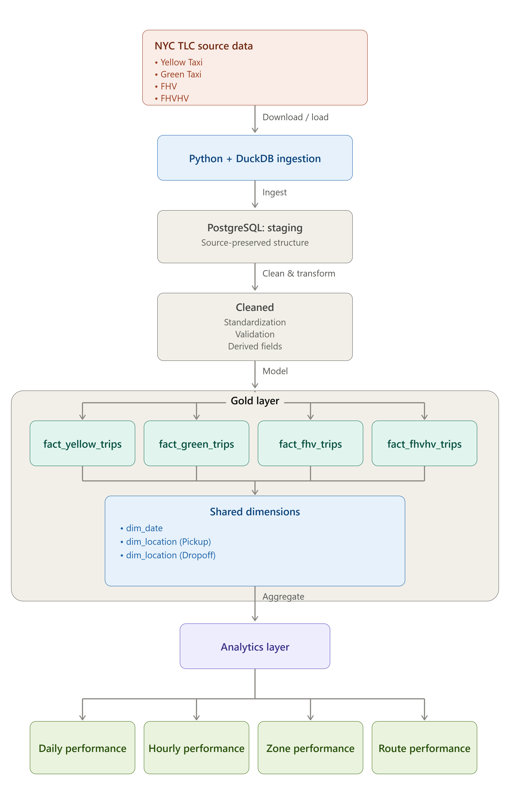

---

title: ⚙️ Data Engineering Projects
layout: page
---

# Data Engineering Projects

This section showcases practical data engineering projects covering **data ingestion, ETL pipelines, data quality, data warehousing, dimensional modelling, and analytics engineering**.

---

# 🚕 NYC TLC Data Engineering Pipeline

**Featured Data Engineering Project**

[GitHub Repository](https://github.com/wahidupal/NYC_TLC_DE_Project)

## Project Overview

An end-to-end data engineering project that ingests, validates, transforms, and models **26.6M+ NYC transportation trip records** from four heterogeneous TLC datasets into a PostgreSQL data warehouse.

The pipeline processes **Yellow Taxi, Green Taxi, FHV, and FHVHV** trip data using Python and DuckDB for ingestion and transformation, followed by layered processing and dimensional modelling in PostgreSQL.

The project focuses on building a reliable data pipeline while preserving source characteristics, identifying data-quality issues, and separating objectively invalid records from unusual but potentially valid observations.

### Key Engineering Work

* Multi-source ingestion of heterogeneous TLC datasets
* Python and DuckDB-based source processing
* PostgreSQL data warehouse implementation
* Source-preserving staging layer
* Data cleaning and standardization
* Extensive data-quality validation
* Investigation of timestamp, duration, financial, location, and distance anomalies
* Service-specific fact tables with shared dimensions
* Star-schema dimensional modelling
* Daily, hourly, zone, and route analytics models
* Source-to-target reconciliation
* Reproducible local pipeline execution

### Architecture

**Source Data → Python + DuckDB → PostgreSQL Staging → Cleaned → Gold Dimensional Model → Analytics**

The pipeline separates source preservation, data-quality handling, dimensional modelling, and analytical workloads into distinct processing stages:

* **Staging:** Preserves source data and structure for traceability and reconciliation
* **Cleaned:** Standardizes schemas, applies objective quality rules, and creates derived fields
* **Gold:** Provides service-specific fact tables with shared `dim_date` and `dim_location` dimensions
* **Analytics:** Provides reusable daily, hourly, zone, and route models at defined analytical grains

### Technology Stack

**Python · DuckDB · PostgreSQL · Pandas · SQL · Git**

[View the detailed project documentation](https://github.com/wahidupal/NYC_TLC_DE_Project)

---

# 🏢 SQL Data Warehouse & Analytics Engineering

**Guided Portfolio Project**

[GitHub Repository](https://github.com/wahidupal/SQL_Data_Warehouse_Project)

## Project Overview

A SQL Server-based data warehouse project integrating CRM and ERP source datasets through a structured **Bronze, Silver, and Gold architecture**.

The project focuses on SQL-based ETL development, data transformation, dimensional modelling, and preparation of analytical datasets for reporting and business analysis.

### Key Engineering Areas

* Multi-source CRM and ERP data integration
* Bronze, Silver, and Gold warehouse architecture
* SQL-based ETL pipelines
* Data cleaning and standardization
* Data-quality validation
* Dimensional modelling
* Star Schema design
* Customer and product dimensions
* Sales fact modelling
* Analytical views
* Stored procedures for automated transformations

### Architecture

The project separates the warehouse into three processing layers:

* **Bronze:** Raw source data ingestion
* **Silver:** Cleaning, transformation, and validation
* **Gold:** Business-ready analytical views

### Technology Stack

**SQL Server · SQL · ETL · Data Warehousing · Star Schema · Stored Procedures · Git**

---

# 🛠️ Technical Skills

### Data Engineering

* Data Ingestion
* ETL / ELT Pipelines
* Data Warehousing
* Dimensional Modelling
* Star Schema Design
* Data Quality Engineering
* Source-to-Target Reconciliation
* Multi-source Data Integration

### Technologies

* **Python**
* **SQL**
* **PostgreSQL**
* **DuckDB**
* **SQL Server**
* **Pandas**
* **Git / GitHub**

### Engineering Practices

* Layered Data Architecture
* Source Data Preservation
* Data Validation
* Anomaly Investigation
* Grain Management
* Reusable Analytical Models
* Reproducible Data Pipelines
