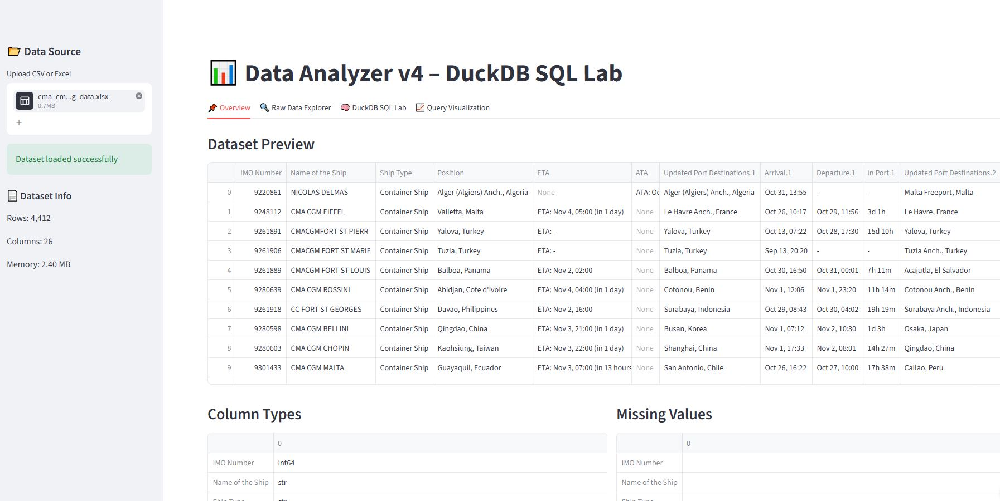

This section showcases Python-based applications developed for data analysis, visualization, automation, and interactive analytics.

The projects demonstrate my experience in building data products using **Python, Streamlit, SQL, data processing libraries, and visualization frameworks** to transform raw data into meaningful and accessible insights.

    

---

# 1. DataSense – Interactive SQL Data Analysis Platform

**GitHub:** [DataSense](https://github.com/wahidupal/DataSense)

---

## Project Summary

DataSense is an interactive data analysis application built with **Streamlit, DuckDB, Plotly, and Pandas**. The application enables users to upload datasets, explore data characteristics, execute SQL queries, and generate interactive visualizations within a single analytical environment.

The project follows a **SQL-first analytics approach**, combining exploratory data analysis capabilities with database-style querying to provide a lightweight alternative for rapid data exploration without requiring an external database system.

---

## Key Features

- Upload CSV and Excel datasets
- Automatic loading of datasets into an in-memory DuckDB database
- Dataset profiling and metadata inspection
- Missing value analysis and data quality checks
- Interactive raw data exploration
- SQL query execution using DuckDB
- Support for:
  - Filtering
  - Aggregations
  - Joins
  - Window functions
- Query-based visualization generation
- Interactive charts using Plotly:
  - Bar charts
  - Line charts
  - Scatter plots
  - Histograms
  - Box plots
- Session-based query history

---

## Technical Highlights

- Designed a SQL-first workflow for exploratory analytics
- Integrated DuckDB as an embedded analytical database engine
- Developed reusable visualization components
- Implemented safe processing limits for handling larger datasets
- Combined database querying, data processing, and visualization into a single application

---

## Technology Stack

- Python
- Streamlit
- DuckDB
- Pandas
- Plotly
- SQL

---

## Skills Demonstrated

- SQL Analytics
- Data Exploration
- Data Validation
- Data Processing
- Interactive Application Development
- Data Visualization
- Analytical Workflow Design

---

# 2. TradeLens – Interactive Stock Market Analytics Platform

**GitHub:** [TradeLens](https://github.com/wahidupal/TradeLens)

---

## Project Summary

TradeLens is an interactive financial analytics application built with **Streamlit** that enables users to explore stock market data through interactive dashboards, technical analysis tools, and forecasting features.

The application combines financial data processing, time-series analysis, and visualization techniques to provide a comprehensive environment for analysing historical and current market trends.

---

## Key Features

- Live stock price monitoring
- Historical market data analysis
- Interactive price charts
- Technical indicator analysis
- Financial trend exploration
- Forecasting functionality
- Dynamic company selection
- Interactive dashboard interface

---

## Technical Highlights

- Integrated financial data retrieval workflows
- Processed and transformed time-series market data
- Developed interactive visual analytics components
- Applied forecasting techniques for trend prediction
- Built modular Streamlit application architecture

---

## Technology Stack

- Python
- Streamlit
- Pandas
- Plotly
- Time-Series Analysis
- Financial Data APIs

---

## Skills Demonstrated

- Python Application Development
- Data Visualization
- Time-Series Analysis
- Financial Analytics
- Interactive Dashboard Development
- Data Processing
